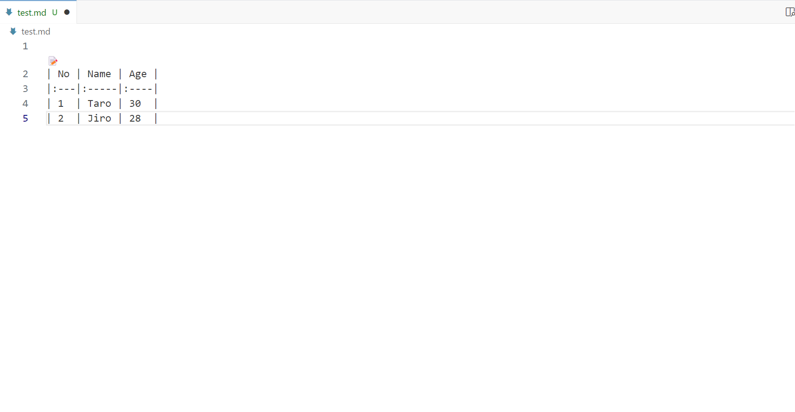

# Markdown Table Editor

A VSCode extension for visually editing markdown tables.

## Features

This extension provides functionality for easily editing tables in markdown files:

- Visual interface for editing markdown tables
- Adding and removing rows and columns
- Editing cell contents
- Table formatting

## Usage

1. Open a markdown file
2. Place your cursor on the first row of a table, and a "📝" button will appear on the left side of the table
3. Click the button
4. Edit the table in the displayed editor
5. Click the "Save" button to apply your changes to the markdown file

## Known Issues

- Performance may decrease when editing very large tables

## Release Notes

[CHANGELOG.md](./CHANGELOG.md)

## License

[MIT](LICENSE.txt)
